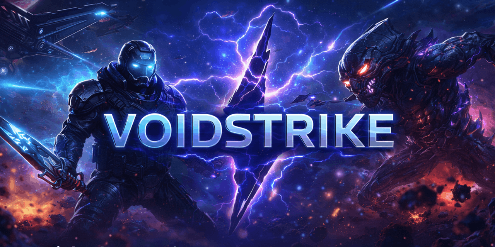
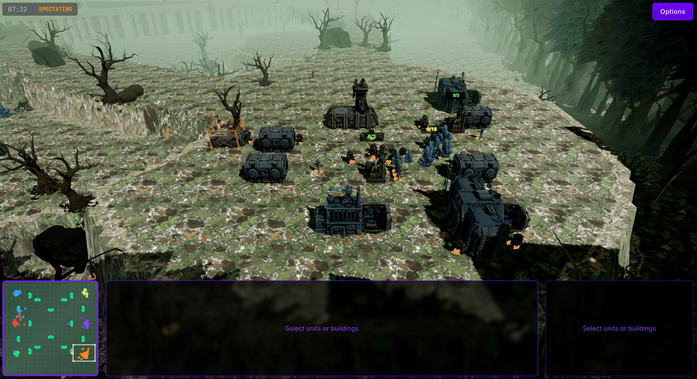
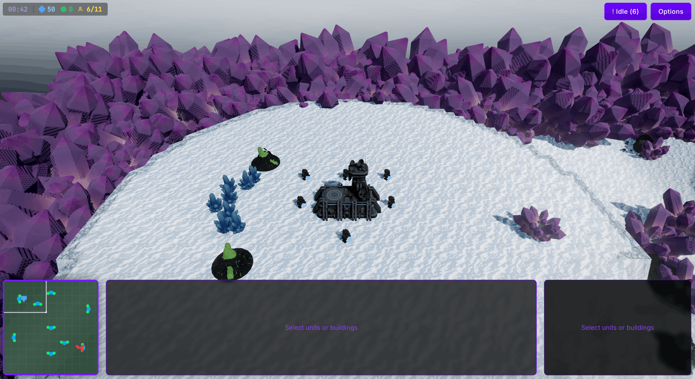
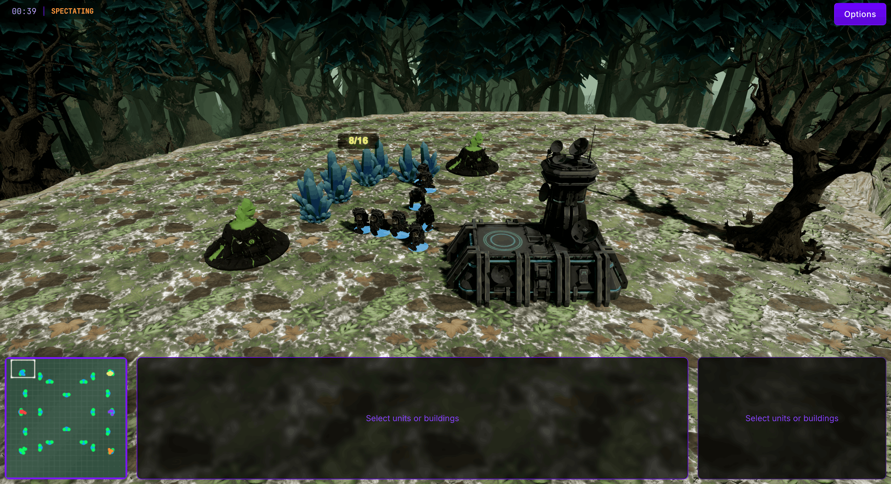

**The browser RTS that makes people ask how this is running in a tab.**

[Quick Start](#quick-start) · [Technical Achievements](#technical-achievements)

VOIDSTRIKE is a browser-native sci-fi RTS built to feel bigger than the browser it runs in. It is chasing the feeling of a full desktop strategy game: heavy atmosphere, big 3D battles, strong visual identity, and real systems depth instead of a stripped-down web prototype.

## Quick Start

- `git clone https://github.com/braedonsaunders/voidstrike.git`
- `cd voidstrike`
- Launch locally with `launch/launch-voidstrike.command` on macOS, `launch/launch-voidstrike.bat` on Windows, or `launch/launch-voidstrike.desktop` on Linux.
- For development, run `npm install` and then `npm run dev`.
- The launcher is the easiest local path; it installs dependencies if needed, builds the game, starts the production server, and opens the browser.

## Technical Achievements

- **A worker-first RTS runtime, not a main-thread prototype.** VOIDSTRIKE runs its authoritative ECS simulation in a dedicated game worker and pushes pathfinding, vision, AI decisions, overlay timing, and countdown logic into separate workers so the game is architected around real browser scheduling behavior instead of ideal conditions.
- **Background-safe fixed-step simulation.** The runtime uses worker-driven fixed-timestep loops specifically to survive tab throttling and keep RTS timing stable when the browser would normally collapse update cadence.
- **Deterministic simulation discipline across the stack.** Quantized math, deterministic ordering, integer square roots, and multiplayer-safe system design are baked into gameplay code paths instead of being left as future cleanup work.
- **Lockstep multiplayer foundations that look like engine work, not glue code.** Input barriers, adaptive command delay, heartbeat flow control, ownership validation, sync requests, and command buffering are already part of the runtime.
- **Built-in desync forensics.** VOIDSTRIKE computes per-tick state checksums and uses Merkle-tree divergence search to localize mismatches in O(log n), which is the kind of tooling usually missing even in serious multiplayer prototypes.
- **Serverless P2P multiplayer with authenticated commands.** The networking stack uses WebRTC data channels with Nostr-backed lobby signaling, and multiplayer inputs are cryptographically signed and verified instead of assuming every peer behaves honestly.
- **Live network adaptation and recovery.** RTT, jitter, and packet loss are measured continuously, command delay adapts to actual network conditions, and reconnection/resync flows are built into the multiplayer layer.
- **A modern WebGPU-first renderer with graceful fallback.** The game targets Three.js r182 + TSL on WebGPU, but still ships a WebGL2 fallback path instead of turning advanced rendering into a hard compatibility wall.
- **A browser post-processing stack that is unusually ambitious for RTS.** GTAO, SSR, SSGI, volumetric fog, classic fog of war, bloom, TRAA, ACES color grading, FSR upscaling, and RCAS sharpening are all in the render pipeline.
- **Custom solutions where stock Three.js paths break down.** VOIDSTRIKE implements per-instance motion vectors for `InstancedMesh`, dual-pipeline TAA/upscaling, and device-lost recovery/fallback paths to make the renderer hold up under real load.
- **GPU-driven battlefield visibility.** Vision and fog-of-war computation run through GPU compute with storage textures and no CPU readback, which is the right architecture for large unit counts and persistent RTS visibility state.
- **Battlefield-scale rendering systems, not just pretty shaders.** The project includes instanced units, instanced buildings, instanced effects, GPU/CPU culling paths, LOD management, instanced selection rings, pooled lights, and GPU-instanced particle systems for large combat scenes.
- **Industry-grade navigation and movement work inside the browser.** VOIDSTRIKE uses Recast Navigation in WASM with dynamic obstacles, separate land and water navmeshes, elevated-map-aware path queries, formations, crowd steering, flocking, and WebAssembly SIMD boids acceleration.
- **A hybrid presentation stack.** The runtime combines WebGPU 3D rendering with a Phaser overlay for tactical indicators, damage numbers, alerts, and screen effects instead of overloading one layer with every job.
- **Real production tooling ships in the same repo.** The codebase includes a reusable 3D map editor, navmesh/connectivity validation, LLM-assisted map generation, a battle simulator, debugging overlays, performance instrumentation, and asset/LOD workflows, which makes it feel like an RTS in active production rather than a rendering experiment.
