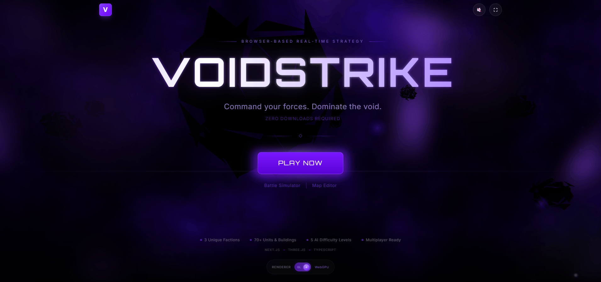

# VOIDSTRIKE

**The browser RTS that makes people ask how this is running in a tab.**

[Quick Start](#quick-start) · [Technical Achievements](#technical-achievements)

VOIDSTRIKE is a browser-native sci-fi RTS built to feel bigger than the browser it runs in. It is chasing the feeling of a full desktop strategy game: heavy atmosphere, big 3D battles, strong visual identity, and real systems depth instead of a stripped-down web prototype.

<em>[ Generic Screenshot Slot ]</em>

## Why People Notice It

- **It looks wrong for the browser.** VOIDSTRIKE leans into cinematic lighting, fog, scale, and readable battlefield silhouettes instead of settling for "good enough for web."
- **It plays like an RTS.** Economy, production, scouting, terrain, army control, and AI skirmishes are already in the playable game.
- **It is more than a render demo.** The project already includes bundled maps, AI opponents, a battle simulator, and an in-browser map editor.
- **It is honest about what exists today.** Dominion is the playable faction right now; Synthesis and Swarm are planned, but not complete.

<em>[ Generic Screenshot Slot ]</em>

## Current State

- **Playable now:** a Dominion-first browser RTS with AI matches, multiple bundled maps, a battle simulator, and a built-in map editor.
- **Still in progress:** additional faction content, more audio and content polish, and broader multiplayer integration.
- **Best browser path:** Chrome or another Chromium browser for WebGPU; modern browsers can fall back to WebGL2.

<em>[ Generic Screenshot Slot ]</em>

## Quick Start

- `git clone https://github.com/braedonsaunders/voidstrike.git`
- `cd voidstrike`
- Launch locally with `launch/launch-voidstrike.command` on macOS, `launch/launch-voidstrike.bat` on Windows, or `launch/launch-voidstrike.desktop` on Linux.
- For development, run `npm install` and then `npm run dev`.
- The launcher is the easiest local path; it installs dependencies if needed, builds the game, starts the production server, and opens the browser.

<em>[ Generic Screenshot Slot ]</em>

## Technical Achievements

- **WebGPU-first 3D rendering with fallback.** VOIDSTRIKE targets a modern Three.js r182 + TSL pipeline with post-processing, atmosphere, and high-end rendering features that are rare in browser RTS projects. When WebGPU is unavailable, the game can still run through WebGL2 instead of failing outright.
- **Deterministic RTS simulation.** The engine is built around ECS systems, quantized math, and simulation rules designed for consistency rather than loose browser-game state updates. That makes the current game more reliable and lays the groundwork for lockstep-style networking and replay correctness.
- **Worker-heavy architecture for real browser constraints.** Timing, pathfinding, and other expensive work are pushed off the main thread so the game is not built around the assumption that the tab always has perfect foreground priority. This is the kind of engineering a browser RTS needs if it wants to survive outside controlled demos.
- **Rendering and fog systems built for battlefield scale.** The project uses instancing, GPU-oriented rendering paths, and advanced fog-of-war/post-processing work to keep large fights readable without flattening the look. The result is a game that tries to sell spectacle and information density at the same time.
- **A full game pipeline, not just a graphics experiment.** The repo includes maps, AI, launch tooling, asset workflows, automated tests, and an in-browser editor alongside the runtime. That gives VOIDSTRIKE the structure to keep growing as a game instead of stopping at a cool technical prototype.
